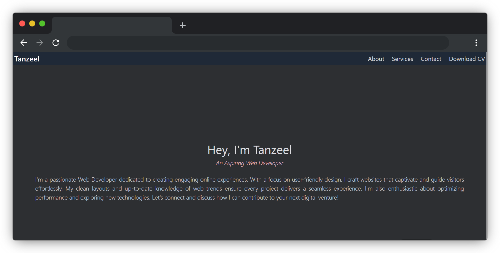

# Tanzeel's Portfolio

Welcome to Tanzeel's Portfolio project! This project showcases a web developer's portfolio using HTML, CSS, and a touch of JavaScript. The portfolio highlights the developer's skills, services offered, and ways to get in touch.

## Table of Contents

- [Description](#description)
- [Features](#features)
- [Technologies Used](#technologies-used)
- [Demo](#demo)
- [Links](#links)
- [Contributors](#contributors)

## Description

Tanzeel's Portfolio is a simple yet engaging web page that introduces Tanzeel as an aspiring web developer. The portfolio provides an about section with a typewriter-like animation, services offered with images, and contact information.

## Features

- Animation effect in the about section for engaging text.
- Services section showcasing skills with animations.
- Contact information with links to social media profiles and email.

## Demo

- [LinkedIn](https://www.linkedin.com/public-profile/settings?trk=d_flagship3_profile_self_view_public_profile)
- [GitHub](https://github.com/Tanzeelbhatti127)
- Email: tanzeelbhatti80@gmail.com

## Tech Stack

**Client:** HTML, TailwindCSS, JavaScript

## Contributors

## 🔗 Demo

